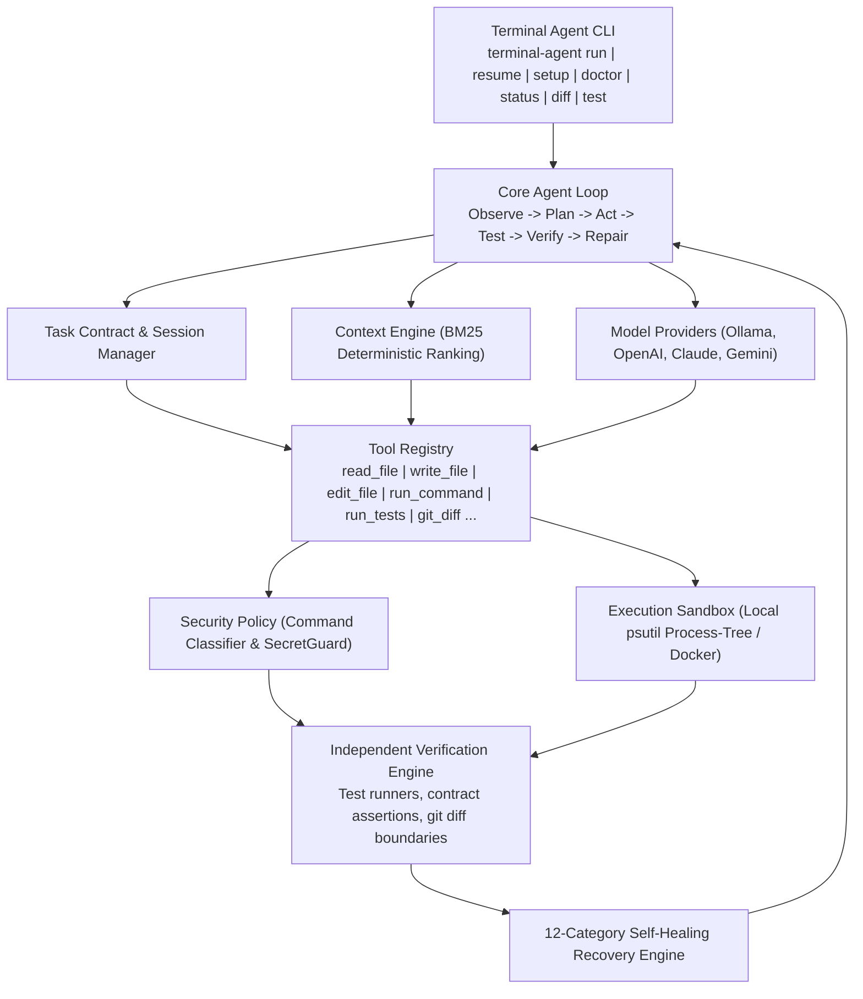

# Terminal Agent

> **Build. Verify. Ship.**  
> An autonomous terminal-based coding agent designed around verifiable software changes.

[](https://pypi.org/project/terminal-agent-cli/)
[](LICENSE)
[](pyproject.toml)

---

## Overview

**Terminal Agent** is an autonomous, terminal-first software engineering agent built by **[PicadoLabs](https://picadolabs.me)**.

Unlike conversational assistants that generate unverified code snippets or claim completion based on language model self-reporting, Terminal Agent enforces a **Verify-First** architectural paradigm. Every task follows a closed-loop engineering workflow:

```
OBSERVE  ->  PLAN  ->  ACT  ->  TEST  ->  INDEPENDENT VERIFY  ->  REPAIR  ->  PROVE COMPLETION
```

A task is only marked `VERIFIED` when an independent verification engine executes test suites inside an isolated sandbox, confirms contract assertions, and validates git diff boundaries.

---

## Why Terminal Agent?

| Challenge with Standard AI Assistants | Terminal Agent Solution |
| :--- | :--- |
| **Hallucinated Success**: LLMs claim "all tests passed" without running them. | **Independent Verifier**: Dual-phase verification runs in a clean sandbox. The agent cannot verify itself. |
| **Runaway Execution**: Loops spin infinitely on difficult errors. | **Bounded Agent Loop**: Hard step limits, timeouts, and structured retry budgets. |
| **Host System Risk**: Unsafe commands (`rm -rf`, network calls) execute directly. | **Multi-Tier Security & Sandboxing**: Command classification (`SAFE`, `WRITE`, `DESTRUCTIVE`, `NETWORK`, `PRIVILEGED`), Docker / Local process-tree sandboxing, and real-time secret redaction. |
| **Lost Progress on Failures**: Bad edits break the repository state. | **Automatic Checkpointing & Rollback**: File snapshots and git branch isolation allow instant rollback to clean baselines. |
| **Context Window Pollution**: Large files blow LLM token limits. | **Deterministic Context Ranker**: BM25-based keyword and AST symbol relevance ranker fitting within strict token budgets. |

---

## Key Features

- **Verify-First Architecture**: Explicit verification states (`PENDING`, `VERIFIED`, `DONE`, `PARTIAL`, `FAILED`, `BLOCKED`).
- **Structured Task Contracts**: Derives goals, allowed file scopes, invariant rules, and success criteria before writing code.
- **12 Core Engineering Tools**: File inspection (`read_file`, `list_files`, `search_files`), atomic editing (`write_file`, `edit_file`), sandboxed execution (`run_command`, `run_tests`), git status/diff (`git_status`, `git_diff`, `git_log`), and checkpoint management (`create_checkpoint`, `restore_checkpoint`).
- **12-Category Failure Classifier & Self-Healing**: Automatically categorizes errors (`SYNTAX_ERROR`, `TEST_FAILURE`, `DEPENDENCY_ERROR`, `TIMEOUT`, `PERMISSION_ERROR`, `NETWORK_ERROR`, `CONTEXT_OVERFLOW`, `TOOL_ERROR`, `WRONG_SOLUTION`, `COMMAND_FAILURE`, `INCOMPLETE_TASK`, `UNKNOWN`) and synthesizes targeted recovery plans.
- **Dual Sandboxing Layer**:
  - **Local Sandbox**: Subprocess isolation with `psutil` process-tree termination to prevent zombie child processes on timeout.
  - **Docker Sandbox**: Containerized execution with optional network isolation.
- **Zero-Trust Secret Guard**: Prevents reading or writing credentials (`.env`, `*.pem`, `*.key`, `.ssh/*`) and redacts API tokens from tool output streams.
- **Model Agnostic**: Supports local open models via **Ollama** (e.g., `qwen2.5-coder`, `llama3`), **OpenAI**, **Anthropic Claude**, **Google Gemini**, and a deterministic **Mock Provider** for CI testing.
- **State Persistence & Resumption**: SQLite database and mirrored JSON session history in `.terminal_agent/` allowing instant session resumption (`terminal-agent resume`).

---

## System Architecture



```
+-----------------------------------------------------------------------------------+
|                               TERMINAL AGENT CLI                                  |
|     terminal-agent [run | resume | setup | doctor | status | diff | test | trace]  |
+-----------------------------------------+-----------------------------------------+
                                          |
                                          v
+-----------------------------------------------------------------------------------+
|                                 CORE AGENT LOOP                                   |
|             Observe  --->  Plan  --->  Act  --->  Verify  --->  Repair            |
+--------------------+--------------------+--------------------+--------------------+
                     |                    |                    |
                     v                    v                    v
+--------------------------+ +--------------------------+ +-------------------------+
|     TASK CONTRACT &      | |      CONTEXT ENGINE      | |   MODEL PROVIDERS       |
|     SESSION MANAGER      | |  (Deterministic Ranking) | | (Ollama, OpenAI, Claude)|
+--------------------------+ +--------------------------+ +-------------------------+
                     |                    |                    |
                     v                    v                    v
+-----------------------------------------------------------------------------------+
|                                   TOOL REGISTRY                                   |
|      read_file | write_file | edit_file | run_command | run_tests | git_diff ...   |
+--------------------+--------------------+--------------------+--------------------+
                     |                    |
                     v                    v
+-----------------------------------------+ +---------------------------------------+
|             SECURITY POLICY             | |             SANDBOX                   |
|   (Command Classification, SecretGuard) | |   (psutil Local & Docker Containers)  |
+-----------------------------------------+ +---------------------------------------+
                     |
                     v
+-----------------------------------------------------------------------------------+
|                          INDEPENDENT VERIFICATION ENGINE                          |
|             (Test runners, contract assertions, git diff boundaries)              |
+-----------------------------------------+-----------------------------------------+
                                          |
                                          v
+-----------------------------------------------------------------------------------+
|                        12-CATEGORY RECOVERY & PROOF OF DONE                       |
+-----------------------------------------------------------------------------------+
```

---

## Installation

### Prerequisites
- **Python**: `3.10`, `3.11`, or `3.12`
- **Git**: `2.30+`

### Option 1: Install from PyPI (Recommended)

Install globally via `pipx` (recommended for isolated CLI tools) or standard `pip`:

```bash
# Using pipx (recommended)
pipx install terminal-agent-cli

# Or using pip
pip install terminal-agent-cli
```

### Option 2: Install from Source (For Development)

```bash
# 1. Clone & install
git clone https://github.com/PicadoLabs/terminal-agent.git
cd terminal-agent
python -m venv .venv
source .venv/bin/activate  # On Windows: .venv\Scripts\Activate.ps1
pip install -e .
```

### Quick Onboarding Flow

Once installed, run interactive setup and verify your environment:

```bash
# 1. Configure model provider (Ollama or Cloud API)
terminal-agent setup

# 2. Verify environment health & ready providers
terminal-agent doctor

# 3. Start your first task
terminal-agent start "Analyze repo and run tests"
```

---

## Model Providers & Onboarding

> **Note**: Ollama is **OPTIONAL**. You do not need Ollama installed if you use cloud providers (OpenAI, Anthropic Claude, or Google Gemini).

Terminal Agent automatically detects available model providers:

### Option A: Interactive Setup (Recommended)
Run the guided interactive setup command:
```bash
terminal-agent setup
```
This command allows you to choose your provider, tests reachability, detects installed models, offers model pull confirmation for missing Ollama models, and safely configures keys.

### Option B: Local Models via Ollama (Free, Private, No API Key)
1. Install [Ollama](https://ollama.com/download) (macOS, Linux, Windows).
2. Download a recommended coding model:
   ```bash
   ollama pull qwen2.5-coder
   ```
3. Terminal Agent will auto-detect your local Ollama instance without needing manual environment variables.

### Option C: Cloud Providers via Environment Variables / `.env`
Set your API key via environment variables or a `.env` file (see [`.env.example`](.env.example)):
```bash
# Anthropic Claude (e.g. claude-3-5-sonnet)
export ANTHROPIC_API_KEY="sk-ant-..."

# OpenAI (e.g. gpt-4o)
export OPENAI_API_KEY="sk-..."

# Google Gemini (e.g. gemini-1.5-pro)
export GEMINI_API_KEY="AIzaSy..."
```

---

## CLI Usage

Run `terminal-agent` inside any codebase or software repository:

### 1. Interactive Provider Setup
```bash
# Interactively configure Ollama, OpenAI, Claude, or Gemini
terminal-agent setup
```

### 2. Check System & Provider Health
```bash
# Inspect toolchains, sandbox, and provider readiness
terminal-agent doctor
```

### 3. Run an Autonomous Task
```bash
# Direct task execution using auto-resolved active provider
terminal-agent run "Fix the authentication token expiry bug and verify with pytest"

# Specify provider and model explicitly
terminal-agent run "Implement CSV streaming parser" --provider anthropic --model claude-3-5-sonnet-20241022

# Free local open model via Ollama
terminal-agent run "Refactor database connection pool" --provider ollama --model qwen2.5-coder
```

### 4. Interactive Mode
```bash
# Launch interactive terminal shell
terminal-agent
```

### 5. Workspace Status & Diff
```bash
# View active session status and step count
terminal-agent status

# View syntax-highlighted git diff of agent modifications
terminal-agent diff
```

### 6. Run Independent Verification
```bash
# Execute test suite through the verification engine
terminal-agent test
```

### 7. Checkpoints & Safe Rollback
```bash
# Create a named snapshot before experimental changes
terminal-agent checkpoint create --name "before_refactor"

# List all available checkpoints
terminal-agent checkpoint list

# Roll back workspace files to a specific checkpoint
terminal-agent rollback <CHECKPOINT_ID>
```

### 8. Resume Interrupted Sessions
```bash
# Resume execution from past state
terminal-agent resume <SESSION_ID>
```

### 9. View Execution Telemetry
```bash
# Print step trace, tool latency, and token metrics
terminal-agent trace <SESSION_ID>
```

---

## Configuration

Initialize or customize workspace configuration via `terminal-agent.config.yaml`:

```bash
terminal-agent config --init
```

### Example `terminal-agent.config.yaml`:
```yaml
agent:
  max_steps: 40
  max_retries: 3
  timeout_seconds: 600
  token_budget: 128000

sandbox:
  mode: local # or docker
  timeout_seconds: 60
  network: disabled # or enabled

verification:
  tests:
    - pytest
  assertions:
    - no_test_files_modified
    - api_contract_preserved
  diff:
    max_files_changed: 5
    allow_untracked_files: true
  auto_rollback_on_failure: false

security:
  network: disabled
  require_confirmation_for:
    - destructive
    - privileged
    - network

provider:
  name: ollama
  model: qwen2.5-coder
```

---

## Project Structure

```
terminal-agent/
├── benchmarks/                   # SWE evaluation benchmark suite
│   ├── tasks/                    # 10 diverse SWE benchmark tasks
│   └── runner.py                 # AgentBench-compatible evaluation harness
│
├── src/
│   └── terminal_agent/
│       ├── agent/                # Bounded autonomous loop orchestrator
│       ├── checkpoints/          # File snapshot and rollback manager
│       ├── cli/                  # CLI commands and Rich terminal UI
│       ├── config/               # Pydantic configuration schemas and settings
│       ├── context/              # BM25 ranker and repository context engine
│       ├── git/                  # Git adapter and working branch manager
│       ├── planner/              # Task contracts and execution planner
│       ├── providers/             # LLM adapters (Ollama, OpenAI, Claude, Gemini, Mock)
│       ├── recovery/              # Failure classifier and recovery engine
│       ├── sandbox/               # Local process and Docker sandbox runners
│       ├── security/              # Command classifier, secret guard, and policy enforcer
│       ├── session/               # SQLite and JSON state persistence
│       ├── telemetry/             # Event logging and performance metrics
│       ├── tools/                 # Typed engineering tools
│       └── verifier/              # Independent test runner and assertion engine
│
├── tests/
│   ├── e2e/                      # Full autonomous repair flow tests
│   ├── integration/              # Git, sandbox, and persistence tests
│   ├── unit/                     # Component unit tests
│   └── validation/               # Security, timeout, and runner validation tests
│
├── .github/
│   ├── ISSUE_TEMPLATE/
│   │   ├── bug_report.md
│   │   └── feature_request.md
│   ├── pull_request_template.md
│   └── workflows/
│       └── ci.yml
│
├── .env.example                  # Environment configuration template
├── .gitignore
├── pyproject.toml                # Package definition and build configuration
├── CONTRIBUTING.md               # Contribution guidelines
├── CODE_OF_CONDUCT.md            # Contributor Covenant code of conduct
├── SECURITY.md                   # Security policy and disclosure process
├── LICENSE                       # MIT License
└── README.md
```
---

## Development & Testing

### Running Tests
```bash
# Run full automated test suite (47 tests)
pytest tests/ -v
```

### Running the SWE Benchmark Suite
```bash
# Run 10-task evaluation benchmark
python -m benchmarks.runner
```

---

## Contributing

We welcome contributions from the community. Please review [CONTRIBUTING.md](CONTRIBUTING.md) for details on our workflow, coding standards, and pull request process.

Please also read our [Code of Conduct](CODE_OF_CONDUCT.md).

---

## Security

Security is critical to Terminal Agent. If you discover a vulnerability, please report it privately by emailing **[picadolabs@gmail.com](mailto:picadolabs@gmail.com)**. For more information, see [SECURITY.md](SECURITY.md).

---

## Community & Maintainers

Terminal Agent is maintained by **[PicadoLabs](https://picadolabs.me)**.

- **GitHub Organization**: [https://github.com/PicadoLabs](https://github.com/PicadoLabs)
- **Website**: [https://picadolabs.me](https://picadolabs.me)
- **Contact & Inquiries**: [picadolabs@gmail.com](mailto:picadolabs@gmail.com)

---

## License

This project is licensed under the **MIT License** - see the [LICENSE](LICENSE) file for details.

Copyright (c) 2026 PicadoLabs.
